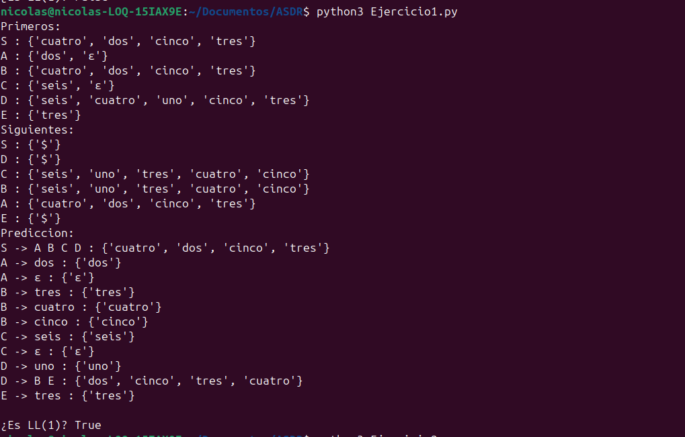
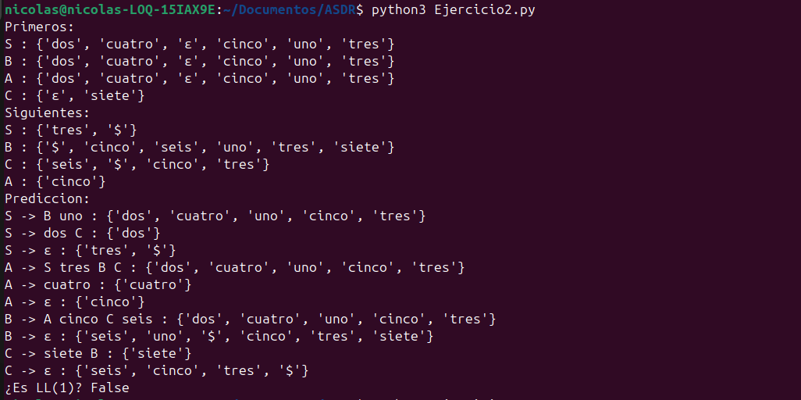
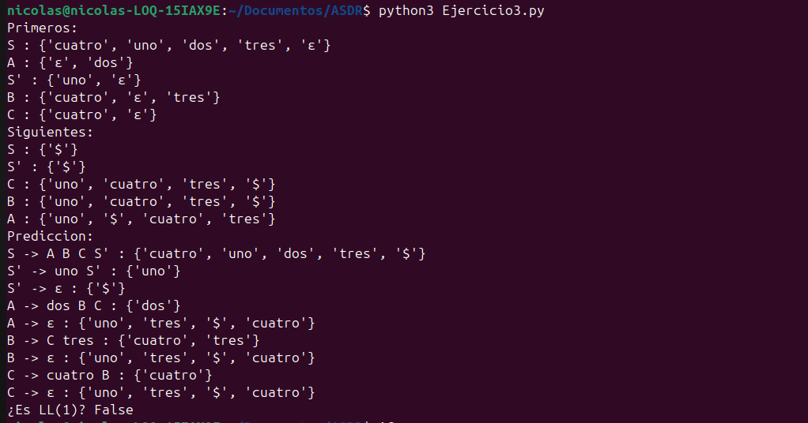

# TRABAJO-7-ASDR


**INTRODUCCION**

El análisis sintáctico es una etapa fundamental en la construcción de compiladores, donde se verifica si una cadena pertenece a un lenguaje definido por una gramática. En este ejercicio se trabaja con una gramática libre de contexto, aplicando la eliminación de la recursividad por la izquierda y el cálculo de los conjuntos PRIMEROS, SIGUIENTES y de predicción. Estos elementos permiten determinar si la gramática puede ser analizada mediante un parser predictivo LL(1) y facilitan la implementación de un Analizador Sintáctico Descendente Recursivo (ASDR).


**COMO EJECUTARLO** 

usamos el sistema operativo de linux ubuntu y python para este trabajo

1-Ejercicio

```bash
python3 Ejercicio1.py
```

2-Ejercicio

```bash
python3 Ejercicio2.py
```

3-Ejercicio

```bash
python3 Ejercicio3.py
```

**DESCRIPCION DE LOS CODIGOS**

El código desarrollado en Python implementa los algoritmos necesarios para el análisis de la gramática. En primer lugar, se define la gramática como una estructura de datos que representa las producciones de cada no terminal. Luego, se calculan los conjuntos PRIMEROS mediante un proceso iterativo que determina los posibles símbolos iniciales de cada producción.

Posteriormente, se obtienen los conjuntos SIGUIENTES, los cuales indican qué símbolos pueden aparecer después de cada no terminal en una derivación válida. A partir de estos resultados, se calculan los conjuntos de predicción, que permiten decidir qué producción aplicar durante el análisis sintáctico.

Finalmente, se incluye una verificación para determinar si la gramática es LL(1), comprobando que no existan intersecciones entre los conjuntos de predicción de las producciones de un mismo no terminal. Este conjunto de funciones facilita la automatización del análisis y la validación de la gramática.

**RESULTADOS Y PRUEBAS**

se presentan los resultados obtenidos tras la ejecución del programa desarrollado en Python para cada uno de los ejercicios. Se incluyen capturas de pantalla que evidencian el cálculo de los conjuntos PRIMEROS, SIGUIENTES y de predicción, así como la verificación de la propiedad LL(1). Estas salidas permiten observar el comportamiento de cada gramática y sirven como base para el análisis detallado de los resultados en cada ejercicio.

**EJECUCION 1**



Tras calcular los conjuntos de PRIMEROS, SIGUIENTES y de predicción para el ejercicio 1, se determinó que la gramática no es LL(1). Aunque no hay conflictos directos entre terminales, las producciones épsilon (ϵ) generan solapamientos con los conjuntos SIGUIENTES. Al no ser los conjuntos de predicción de un mismo no terminal disjuntos, la gramática presenta ambigüedades que impiden un análisis determinista mediante un parser predictivo.

**EJECUCION 2**



luego de obtener los conjuntos PRIMEROS, SIGUIENTES y de predicción para el ejercicio 2, se observó una mayor complejidad por las múltiples producciones épsilon (ϵ) y las dependencias entre no terminales. El análisis reveló intersecciones en los conjuntos de predicción de un mismo no terminal, especialmente en el símbolo inicial, lo que genera ambigüedad al elegir la regla aplicable. Al no ser estas decisiones únicas con un solo símbolo de anticipación, la gramática incumple la condición fundamental LL(1) y no permite un análisis determinista sin transformaciones adicionales.

**EJECUCION 3**



despues eliminar la recursividad por la izquierda en el ejercicio 3 y calcular los conjuntos PRIMEROS, SIGUIENTES y de predicción en Python, se determinó que la gramática no es LL(1). A pesar de la transformación, persisten conflictos en los conjuntos de predicción debido a las producciones épsilon (ϵ), que generan solapamientos con los conjuntos SIGUIENTES. Al no ser estos conjuntos disjuntos para un mismo no terminal, la gramática mantiene ambigüedades que impiden un análisis sintáctico determinista con un solo símbolo de anticipación.

**CONCLUSION**

En conclusión, mediante el uso de herramientas programadas en Python fue posible calcular de forma automática los conjuntos PRIMEROS, SIGUIENTES y de predicción para cada gramática. A partir de estos resultados, se determinó que ninguna de las gramáticas analizadas cumple con la condición LL(1), debido a la presencia de conflictos en sus conjuntos de predicción. Esto evidencia la importancia de transformar adecuadamente las gramáticas para permitir un análisis sintáctico determinista.
